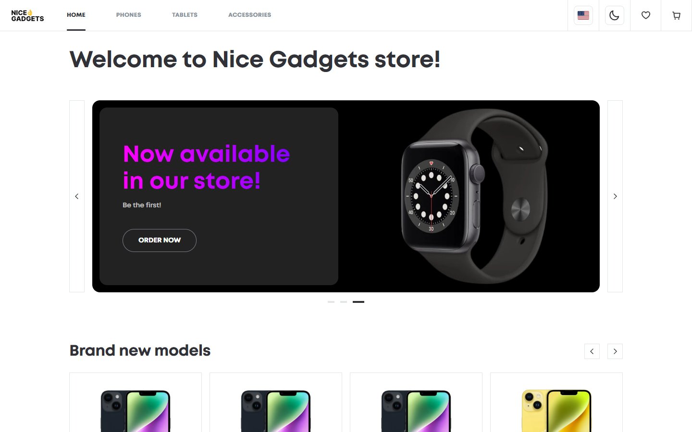
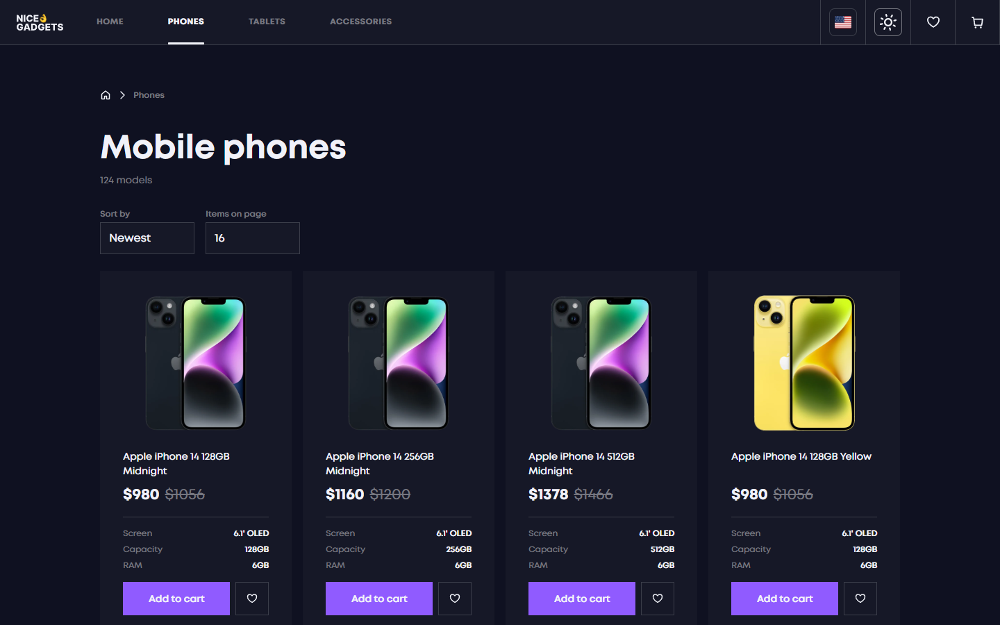
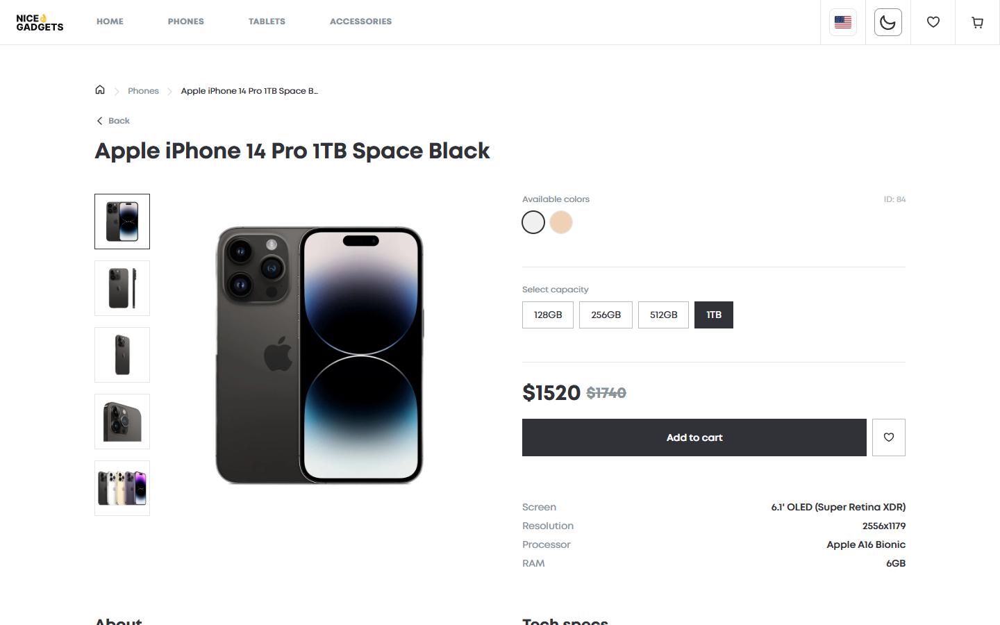
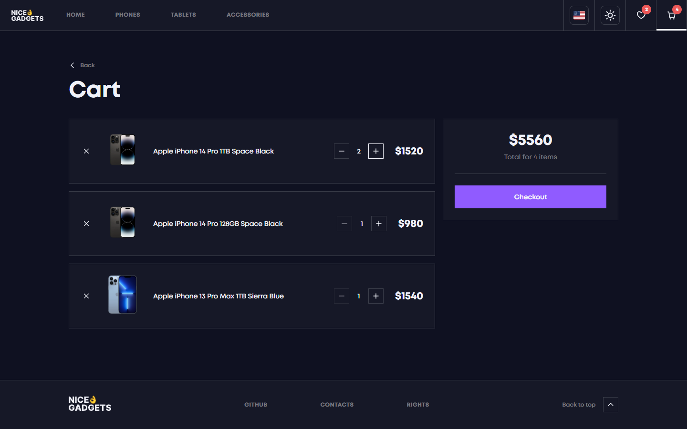

# 📱 Phone Catalog


A responsive e-commerce catalog for phones, tablets, and accessories, built with React and TypeScript. It features product browsing with filtering and sorting, a shopping cart, favorites, a product details page, dark mode, and multi-language support.

## 🔗 Live Preview

**[View the live demo →](https://augustwise.github.io/react-phone-catalog/#/)**

## 🎨 Design Reference

**[Figma — Phone Catalog (V2) →](https://www.figma.com/file/T5ttF21UnT6RRmCQQaZc6L/Phone-catalog-(V2)-Original)**

## 🛠️ Technologies Used

- **React 18** — component-based UI
- **TypeScript** — static typing
- **Vite** — fast build tooling and dev server
- **React Router v6** — client-side routing
- **Sass (SCSS)** — styling and theming
- **Swiper** — touch-friendly sliders and carousels
- **i18next / react-i18next** — internationalization
- **Bulma** — CSS framework
- **yet-another-react-lightbox** — image gallery
- **Cypress** — end-to-end testing

## 🚀 Getting Started

Make sure you have **Node.js 20** installed.

```bash
git clone https://github.com/augustwise/react-phone-catalog.git
cd react-phone-catalog

npm install

npm start
```

Vite serves the app at `http://localhost:5173/react-phone-catalog/` (it falls back to the next port, e.g. `5174`, if `5173` is already in use).

### Other useful scripts

```bash
npm run build    # Build the project for production
npm run lint     # Run linters and formatters
npm run deploy   # Deploy to GitHub Pages
```

## ✨ Features

- 🏠 **Home page** with hero banner, brand-new models, and hot-price sliders
- 📱 **Product catalog** for phones, tablets, and accessories with pagination
- 🔎 **Sorting and filtering** by price, newest, and items per page
- 📄 **Product details page** with image gallery, color/capacity selection, and specs
- 🛒 **Shopping cart** with quantity controls and total price
- ❤️ **Favorites** to save products for later
- 🌙 **Dark / light theme** toggle with smooth View Transitions
- 🌐 **Multi-language support** via i18next
- 📱 **Fully responsive** design across mobile, tablet, and desktop
- ⚡ **Optimized performance** with lazy-loaded pages and prerendered home page

## 📸 Screenshots

### Home Page
A welcoming landing page with a hero slider and curated product carousels.



### Phones Catalog (Dark Mode)
Browse the full phone catalog with sorting, filtering, and dark theme.



### Product Details
Detailed product view with an image gallery, configuration options, and full specifications.



### Shopping Cart (Dark Mode)
Review selected items, adjust quantities, and see the total price at a glance.


